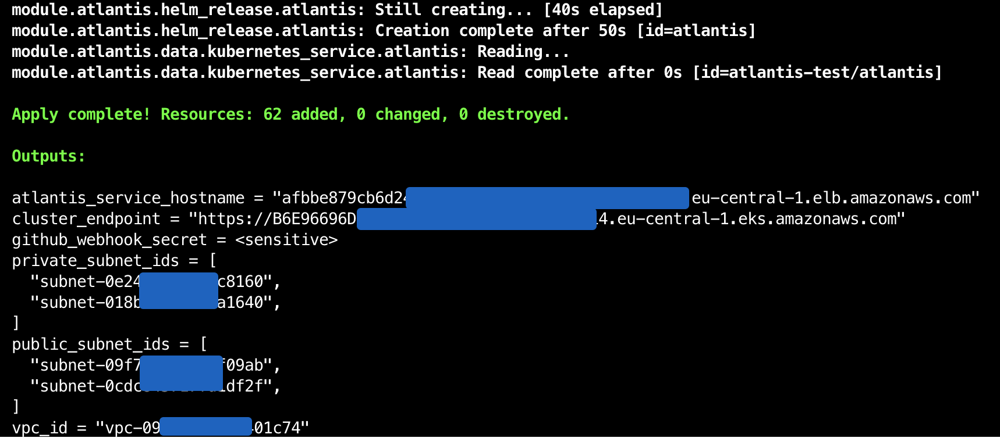
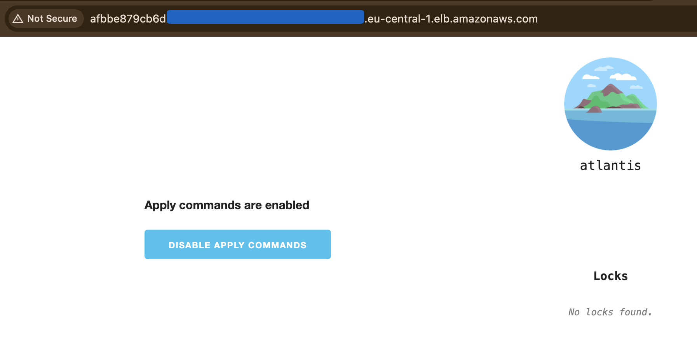
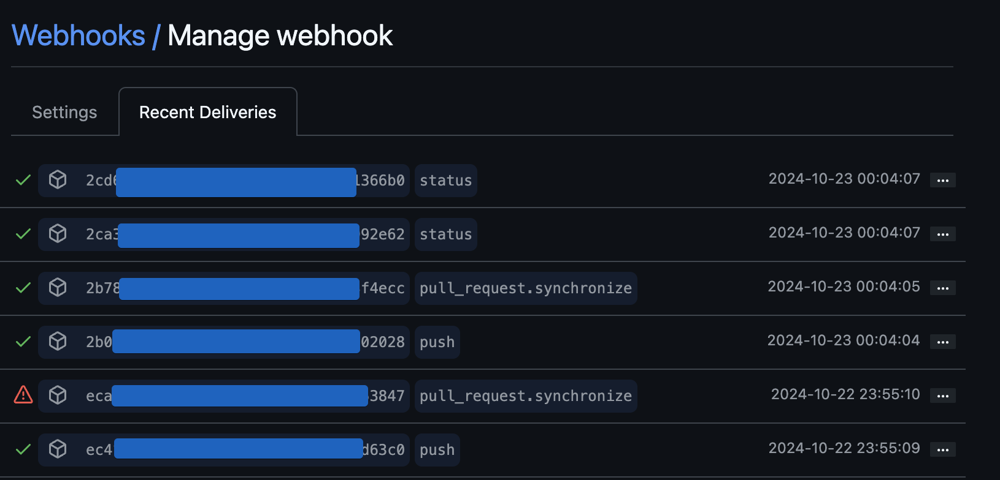
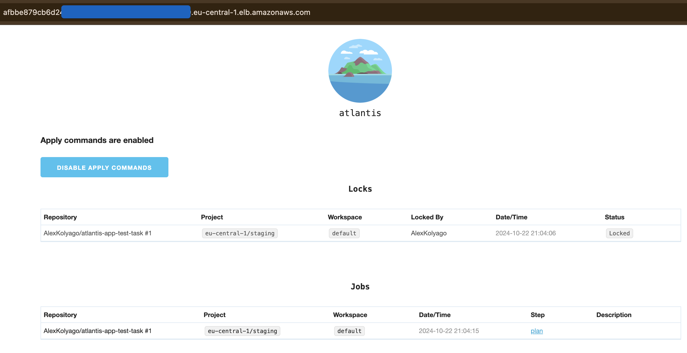
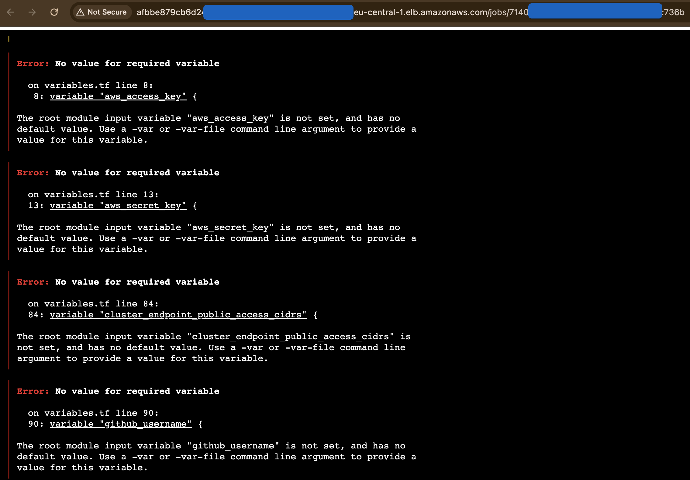

### Deployment

```hcl
terraform init
terraform plan
terraform apply
```

### Proof

Terraform output:



Atlantis app:



Working webhooks:



Atlantis synced by PR:



Atlantis tf plan:




### NOTES
stuck with kubernetes namespace

```hcl
module.atlantis.kubernetes_namespace.atlantis: Creating...
╷
│ Error: Unauthorized
│
│   with module.atlantis.kubernetes_namespace.atlantis,
│   on modules/atlantis/main.tf line 1, in resource "kubernetes_namespace" "atlantis":
│    1: resource "kubernetes_namespace" "atlantis" {
│
╵
```

UPD: solved by token usage in K8s provider

```hcl
token = data.aws_eks_cluster_auth.cluster.token
```

```hcl
Error: Get "http://localhost/api/v1/namespaces/atlantis-test": dial tcp [::1]:80: connect: connection refused
```
resolved by: ```enable_cluster_creator_admin_permissions = true``` in eks modole

atlantis docs: https://github.com/runatlantis/helm-charts/blob/main/charts/atlantis/values.yaml