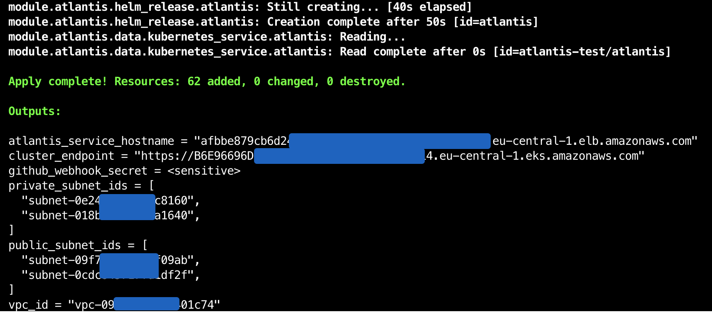
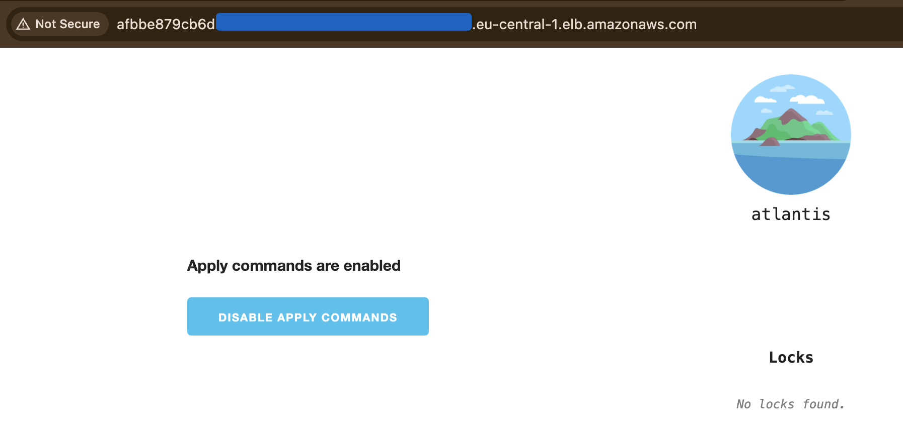

### NOTES
stuck with kubernetes namespace

```hcl
module.atlantis.kubernetes_namespace.atlantis: Creating...
╷
│ Error: Unauthorized
│
│   with module.atlantis.kubernetes_namespace.atlantis,
│   on modules/atlantis/main.tf line 1, in resource "kubernetes_namespace" "atlantis":
│    1: resource "kubernetes_namespace" "atlantis" {
│
╵
```

UPD: solved by token usage in K8s provider

```hcl
token = data.aws_eks_cluster_auth.cluster.token
```

atlantis docs: https://github.com/runatlantis/helm-charts/blob/main/charts/atlantis/values.yaml

### Proof

Terraform output:



Atlantis app:

